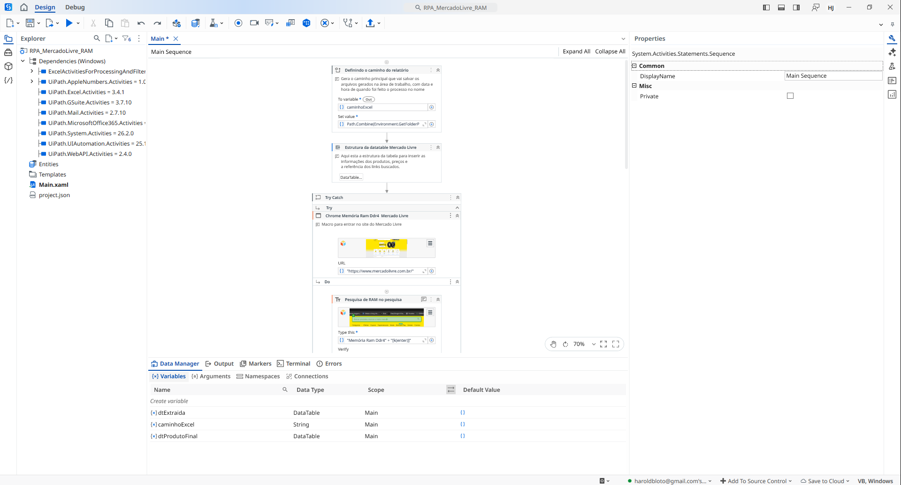
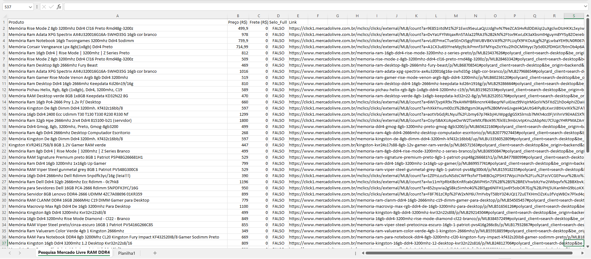

# RPA-MercadoLivre-Scraper

Este projeto de RPA foi desenvolvido usando **UiPath** para monitorar o mercado de memória RAM, no caso apenas a DDR4 mas podendo ser sobre qualquer produto do site em tempo real.
O macro usado por este robô automatiza a pesquisa de produtos no Mercado Livre, extraindo do metadata do site para análise de mercado e registrando um relatório estruturado no Excel.

## Funcionalidades
- **Navegação Dinâmica:** Realiza a busca automática por produtos específicos (No caso a RAM DDR4).
- **Extração de Metadados:** Captura atributos de acessibilidade (aria-label) em ícones SVG para identificar o selo **FULL**.
- **Normalização de Dados:** Uso de **Regex (Expressões Regulares)** para limpar strings monetárias e converter preços e fretes em formato `Double` (numérico).
- **Relatório Profissional:** Gera planilha com cabeçalhos organizados e nomes de arquivos datados.
- **Resiliência:** Tratamento de exceções com **Try-Catch** para lidar com variações de carregamento do site.

## Tecnologias e Conceitos
- **UiPath Studio** (Arquitetura hibrida Modern/Classic).
- **Regex:** Para extração cirúrgica de valores decimais, ignorando textos de marketing (ex: "% OFF").
- **XML Metadata:** Customização manual de seletores para maior estabilidade.
- **VB.NET:** Lógica de conversão de tipos e tratamento de nulos.

## Como Executar
1. Instale o UiPath Studio.
2. Clone este repositório.
3. Abra o `project.json` e execute o `Main.xaml`.
4. Quando o macro finalizar irá gerar um relatório na sua Área de Trabalho (O tempo pode variar de acordo com sua conexão com a internet ou problemas com o Chrome).
5. A base do mesmo pode ser usada para qualquer tipo de consulta de mercado na Mercado Livre sujeito somente a alterações no input inicial e da adição das tabelas das informações requeridas no DataTable e no DataRow.

Contato: Haroldjonathanavila@gmail.com
